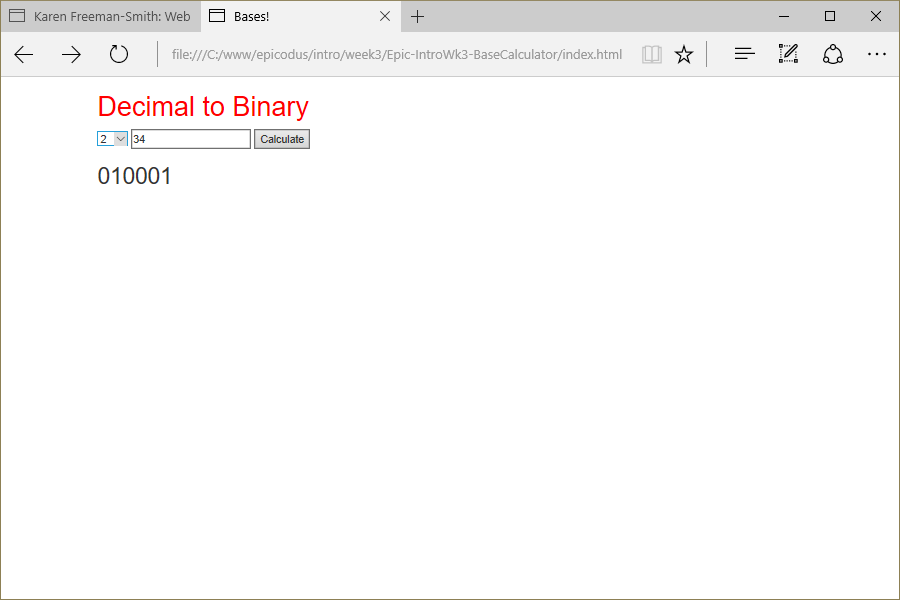

# Base Calculator
Version 0.0.1: August 17, 2016
by [Karen Freeman-Smith](https://karenfreemansmith.github.io) and [Caleb Paul](https://github.com/CalebPaul)

### Technologies Used
HTML, CSS, Bootstrap, JavaScript, jQuery

## Description
*[Epicocus](http://epicodus.com) Intro to Programming Week 3 Pair Project with Caleb Paul: A website that converts between bases.*

## Setup/Installation
* [View on Github Pages](https://karenfreemansmith.github.io/Epic-IntroWk3-BaseCalculator)
* _OR_
* Clone directory
* Open index.html in your favorite browser

## Support & Contact
For questions, concerns, or suggestions please email karenfreemansmith@gmail.com

## Specifications
* Enter a decimal number.
* Convert to specified base (2/8/16 etc)

## Known Issues
* None

## Legal
*Licensed under the GNU General Public License v3.0*

Copyright (c) 2016 Copyright _[Karen Freeman-Smith](https://karenfreemansmith.github.io) & [Caleb Paul](https://github.com/CalebPaul)_ All Rights Reserved.
